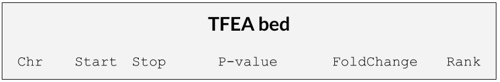
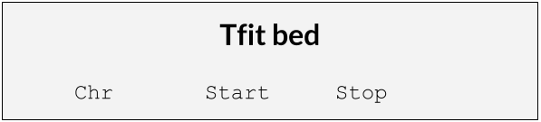

##############
Input Files
##############

The python module takes in a .bed file (ranked_file.center.sorted.bed) from TFEA and plots the base content across positions.

The module also takes in Tfit bed files in the format shown below.

In addition to a a bed file of coordinates to be plotted, the GC_content also a fasta file of the reference genome.
The fasta file should be indexed and also should match the format of the bed file.

* USCS format (chr1:start-stop)

* Ensembl/NCBI format (1:start-stop)

##################
Running GC_content
##################

To run GC_content in the commandline::

    python base_content -r /path/to/reference/hg38.fa -b ./my_bedfile.bed -o /output/dir/ -d /path/to/intermediate_bed.bed -f /path/to/intermediate_fasta.fa -w 1500
 