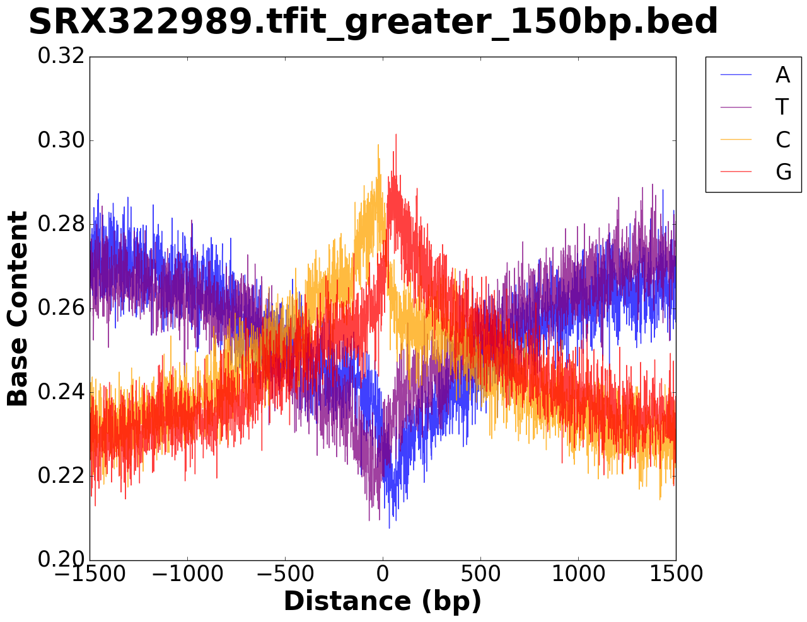
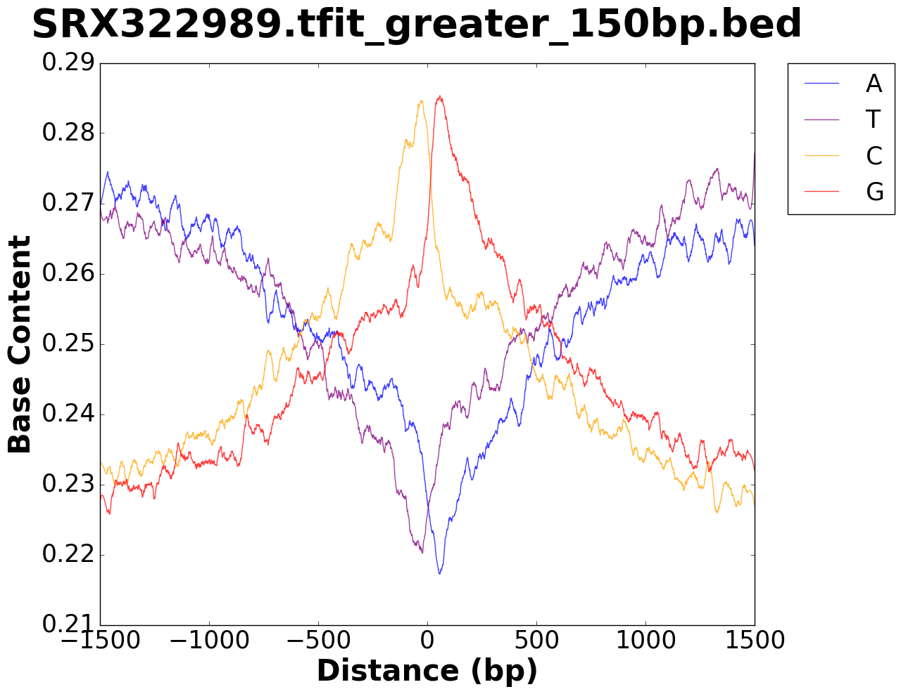
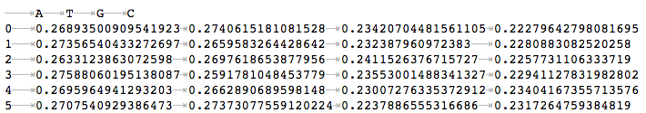

#########################
Install from GitHub
#########################

This module can be cloned from the GitHub repo to your local machine.

>>> git clone https://github.com/rutendos/base_content.git

Todo: Add to conda and PyPI

##############
Requirements
##############

Implementation is done in python 3 (Python 3.6.3)

This tool relies on bedtools (https://bedtools.readthedocs.io/en/latest/)

Python modules:

* argparse (https://docs.python.org/3/howto/argparse.html)

>>> pip install argparse

* pandas (https://pandas.pydata.org/)

>>> pip install pandas

* numpy (http://www.numpy.org/)

>>> pip install numpy 

* matplotlib (https://matplotlib.org/)

>>> pip install matplotlib 

##############
Input Files
##############

The python module takes in a .bed file (ranked_file.center.sorted.bed) from TFEA and plots the base content across positions.

.. image:: figs/TFEA_bed_format.png
   :width: 600
   :align:   center

The module can also take in Tfit bed files in the format shown below.

.. image:: figs/Tfit_bed_file.png
   :width: 400
   :align:   center

In addition to a a bed file of coordinates, the base_content requires a fasta file of the reference genome.
The fasta file should be indexed and also should match the format of the bed file.
(Make sure that the genome file has been indexed. If a fasta file is indexed it will have a .fai extension.)

* USCS format (chr1:start-stop)

* Ensembl/NCBI format (1:start-stop)

###################
Algorithm Overview
###################

######################
Running base_content
######################

*****************************
Running in the command line
*****************************

To run base_content with TFEA bedfile in the commandline::

    python base_content -r /path/to/reference/hg38.fa -b ./my_bedfile.bed -o /output/dir/ -w 1500 -s experiment_name -t

To run base_content with Tfit or other bedfile in the commandline::

    python base_content -r /path/to/reference/hg38.fa -b ./my_bedfile.bed -o /output/dir/ -w 1500 -s experiment_name

********************
Running on Fiji
********************
Since Fiji is still running python 2 the recommendation is to load a python 3 environment 

>>> module load python/3.6.3

Once an environment has been set, install modules to the environment.

>>> pip3 install numpy pandas matplotlib --user

An example sbatch script for a TFEA bed file is shown below.

..example sbatch::

    #!/bin/bash                                                                                                                                                    

    ###Name the job                                                                                                                                      
    #SBATCH --job-name=Allen2014_ATGC  

    ###Specify the queue                                                                         
    #SBATCH -p short                                                                                                                                               

    ###Specify WallTime                                                                          
    #SBATCH --time=0:20:00                                                                                                                                        

    ### Specify the number of nodes/cores                                                        
    #SBATCH --nodes=1                                                                                                                                              
    #SBATCH --ntasks=1                                                                                                                                  

    ### Allocate the amount of memory needed                                                                                                                      
    #SBATCH --mem=2gb                                                                                                                                            

    ### Setting to mail when the job is complete                           
    #SBATCH --error /scratch/Users/rusi2317/projects/gc_content/e_and_o/%x.err                                                                         
    #SBATCH --output /scratch/Users/rusi2317/projects/gc_content/e_and_o/%x.out                                                                        

    ### Set your email address                                                                                                                                     
    #SBATCH --mail-type=ALL                                                                                                                                        
    #SBATCH --mail-user=rutendo.sigauke@ucdenver.edu  

    module purge
    module load python/3.6.3
    module load python/3.6.3/numpy
    module load python/3.6.3/matplotlib
    module load python/3.6.3/pandas
    module load bedtools/2.25.0

    BIN=/scratch/Users/rusi2317/projects/gc_content/bin

    OUTDIR=/scratch/Users/rusi2317/projects/gc_content/analysis/Allen2014_v2

    GENOME=/scratch/Users/rusi2317/projects/gc_content/genome

    BED=/scratch/Users/rusi2317/projects/tfea/output/Allen2014/TFEA_DMSO_1hr-Nutlin_1hr_3/temp_files

    NAME=Allen2014_width1000

    ##run the base_content

    python3 ${BIN}/base_content//base_content -r ${GENOME}/hg19.fa -b ${BED}/ranked_file.center.sorted.bed -o ${OUTDIR}/ -w 1000 -s ${NAME} 

A bedfile with about 6000 regions should take no more than 5 minutes on fiji. 

*********************
Output Files
*********************

The output folder contains figures for the base content in the window specified, 

as well as a .tsv file with values used to plot the figure.   

In addition, the intermediate window bed and the sequences extracted from the genome are also saved in the output folder.